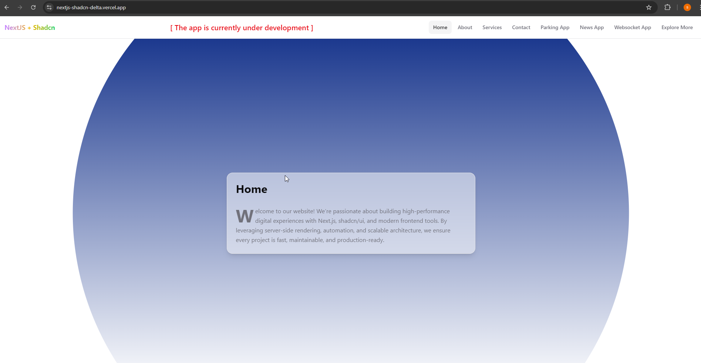

# 📰 News, 🚗 Parking and 📈 Live Trading Apps

### Fast, Interactive, and Fully Deployed Multi-App Experience
A suite of modern applications — News, Parking, and Live Trading — built with a blazing-fast frontend stack. Powered by Next.js, TypeScript, and styled with Shadcn UI, the apps deliver seamless performance and a clean user experience.

Deployed on Vercel for effortless scalability, instant updates, and smooth performance worldwide.

👉 **Live Demo**: [NextJS + Shadcn UI](https://nextjs-shadcn-delta.vercel.app/parking)

---

## 🚀 Features
- ⚡️ **High Performance** — Optimized builds and fast reloads with Vite.
- 🎨 **Modern UI** — Responsive, accessible design with [Shadcn UI](https://ui.shadcn.com/docs/components).
- 📦 **State Management** — Currently using React state, with plans to integrate [zustand](https://github.com/pmndrs/zustand) and [@tanstack/react-query](https://tanstack.com/query) for efficient data handling.
- 🔗 **REST API Integration** — Live News powered by Alphavantage [News API](https://www.alphavantage.co/).
- ✅ **Testing Ready** — Planned integration with Jest & React Testing Library.

---

## 🛠️ Tech Stack

### Frontend
- [React](https://react.dev/)
- [Next.js](https://nextjs.org/docs/)
- [TypeScript](https://www.typescriptlang.org/)
- [Shadcn UI](https://ui.shadcn.com/)
- [zustand](https://github.com/pmndrs/zustand)
- [@tanstack/react-query](https://tanstack.com/query)

### Testing
- [Jest](https://jestjs.io/)
- [@testing-library/react](https://testing-library.com/docs/react-testing-library/intro/)

### Build Tool
- [Vite](https://vitejs.dev/)

### API
- [News API](https://www.alphavantage.co/)

---

## 🌐 Deployment
The app is deployed on [Vercel](https://vercel.com/), ensuring:
- ⚡ Instant global edge deployment
- 🔄 Continuous integration with GitHub
- 🕒 Zero downtime updates

---

## 📸 Preview

Take a look at the multi-app experience in action from smart parking to live trading and news updates, everything is designed to be simple, modern, and highly interactive.

- 🏠 **Smart Parking System** — Find and manage parking spaces in real-time with a clean and user-friendly interface.  
  
  ![Check-Out Page]

- 📰 **News & Insights** — Stay updated with the latest financial and global news, neatly categorized for easy browsing.
  

- 📈 **Realtime Trade Data (BTC/USDT)** — Track live cryptocurrency price movements with instant updates and smooth charts.
  

- 🏡 **Home Page** — A welcoming landing page with quick access to all major features. 
  

- ℹ️ **About Page** — Learn more about the project and its goals with a simple, elegant layout.
  

- 🛠️ **Services Page** — Explore the available services and tools offered across apps. 
  

- 📞 **Contact Page** — Get in touch easily with a streamlined, intuitive contact form.  
  


## 📦 Getting Started

### 1. Clone the repo
```
    git clone https://github.com/satheeshpolu/nextjs-shadcn.git
    cd nextjs-shadcn 
``` 

### 2. Install dependencies

```
nextjs-shadcn > npm install
```
### 3. Start development server
```
nextjs-shadcn > npm run dev
```

### 4. Run tests
```
nextjs-shadcn > npm run test
```

### 5. Build the app
```
nextjs-shadcny > npm run build
```

## Learn More

To learn more about Next.js, take a look at the following resources:

- [Next.js Documentation](https://nextjs.org/docs) - learn about Next.js features and API.
- [Learn Next.js](https://nextjs.org/learn) - an interactive Next.js tutorial.
